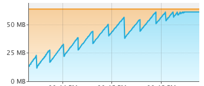
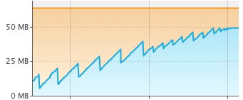
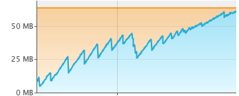
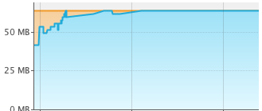

Пример работы GC:

-XX:+UseSerialGC

[2020-09-11T23:41:55.394-0300][0.070s][info][gc] Using Serial
[2020-09-11T23:42:33.562-0300][38.237s][info][gc] GC(0) Pause Young (Allocation Failure) 17M->6M(61M) 49.238ms
[2020-09-11T23:42:55.276-0300][59.951s][info][gc] GC(1) Pause Young (Allocation Failure) 23M->11M(61M) 53.407ms
[2020-09-11T23:43:28.087-0300][92.760s][info][gc] GC(2) Pause Young (Allocation Failure) 28M->16M(61M) 41.048ms
[2020-09-11T23:44:02.446-0300][127.118s][info][gc] GC(3) Pause Young (Allocation Failure) 33M->22M(61M) 35.520ms
[2020-09-11T23:44:37.562-0300][162.233s][info][gc] GC(4) Pause Young (Allocation Failure) 39M->28M(61M) 34.643ms
[2020-09-11T23:45:13.670-0300][198.340s][info][gc] GC(5) Pause Young (Allocation Failure) 45M->34M(61M) 41.303ms
[2020-09-11T23:45:51.467-0300][236.136s][info][gc] GC(6) Pause Young (Allocation Failure) 51M->40M(61M) 43.316ms
[2020-09-11T23:46:29.872-0300][274.521s][info][gc] GC(7) Pause Young (Allocation Failure) 57M->57M(61M) 0.083ms
[2020-09-11T23:46:30.099-0300][274.748s][info][gc] GC(8) Pause Full (Allocation Failure) 57M->38M(61M) 219.572ms
[2020-09-11T23:47:08.990-0300][313.634s][info][gc] GC(9) Pause Young (Allocation Failure) 55M->55M(61M) 0.064ms
[2020-09-11T23:47:09.169-0300][313.813s][info][gc] GC(10) Pause Full (Allocation Failure) 55M->44M(61M) 170.995ms
[2020-09-11T23:47:47.811-0300][352.454s][info][gc] GC(11) Pause Full (Allocation Failure) 61M->51M(61M) 182.456ms
[2020-09-11T23:48:12.227-0300][376.869s][info][gc] GC(12) Pause Full (Allocation Failure) 61M->53M(61M) 215.362ms
[2020-09-11T23:48:30.416-0300][395.057s][info][gc] GC(13) Pause Full (Allocation Failure) 61M->56M(61M) 198.752ms
[2020-09-11T23:48:41.419-0300][406.060s][info][gc] GC(14) Pause Full (Allocation Failure) 61M->58M(61M) 205.087ms
[2020-09-11T23:48:48.353-0300][412.994s][info][gc] GC(15) Pause Full (Allocation Failure) 61M->60M(61M) 217.430ms
[2020-09-11T23:48:52.533-0300][417.174s][info][gc] GC(16) Pause Full (Allocation Failure) 61M->60M(61M) 247.736ms
[2020-09-11T23:48:55.719-0300][420.360s][info][gc] GC(17) Pause Full (Allocation Failure) 61M->61M(61M) 212.791ms

половину времени использует GC

-XX:+UseParallelGC

[2020-09-11T23:34:58.447-0300][0.058s][info][gc] Using Parallel
[2020-09-11T23:35:12.129-0300][13.740s][info][gc] GC(0) Pause Young (Allocation Failure) 16M->4M(61M) 16.605ms
[2020-09-11T23:35:40.464-0300][42.073s][info][gc] GC(1) Pause Young (Allocation Failure) 20M->8M(61M) 15.996ms
[2020-09-11T23:36:12.578-0300][74.187s][info][gc] GC(2) Pause Young (Allocation Failure) 24M->13M(61M) 18.137ms
[2020-09-11T23:36:44.874-0300][106.482s][info][gc] GC(3) Pause Young (Allocation Failure) 29M->18M(61M) 17.816ms
[2020-09-11T23:37:17.368-0300][138.975s][info][gc] GC(4) Pause Young (Allocation Failure) 34M->23M(61M) 17.159ms
[2020-09-11T23:37:50.591-0300][172.197s][info][gc] GC(5) Pause Young (Allocation Failure) 39M->29M(52M) 26.232ms
[2020-09-11T23:38:05.644-0300][187.250s][info][gc] GC(6) Pause Young (Allocation Failure) 36M->32M(57M) 11.127ms
[2020-09-11T23:38:20.888-0300][202.493s][info][gc] GC(7) Pause Young (Allocation Failure) 39M->34M(57M) 14.089ms
[2020-09-11T23:38:36.262-0300][217.867s][info][gc] GC(8) Pause Young (Allocation Failure) 41M->37M(57M) 25.240ms
[2020-09-11T23:38:51.639-0300][233.244s][info][gc] GC(9) Pause Young (Allocation Failure) 44M->39M(57M) 22.207ms
[2020-09-11T23:39:06.864-0300][248.467s][info][gc] GC(10) Pause Young (Allocation Failure) 46M->42M(57M) 16.986ms
[2020-09-11T23:39:06.991-0300][248.594s][info][gc] GC(11) Pause Full (Ergonomics) 42M->40M(57M) 124.551ms
[2020-09-11T23:39:22.888-0300][264.492s][info][gc] GC(12) Pause Full (Ergonomics) 47M->42M(57M) 117.795ms
[2020-09-11T23:39:38.221-0300][279.824s][info][gc] GC(13) Pause Full (Ergonomics) 49M->45M(57M) 129.763ms
[2020-09-11T23:39:48.672-0300][290.275s][info][gc] GC(14) Pause Full (Ergonomics) 49M->47M(57M) 142.650ms
[2020-09-11T23:39:55.065-0300][296.667s][info][gc] GC(15) Pause Full (Ergonomics) 49M->48M(57M) 138.935ms
[2020-09-11T23:39:59.073-0300][300.675s][info][gc] GC(16) Pause Full (Ergonomics) 49M->48M(57M) 141.994ms

[2020-09-11T23:40:01.405-0300][303.008s][info][gc] GC(17) Pause Full (Ergonomics) 49M->49M(57M) 137.343ms

[2020-09-11T23:40:03.089-0300][304.691s][info][gc] GC(18) Pause Full (Ergonomics) 49M->49M(57M) 140.170ms

40%

-XX:+UseG1GC 

[2020-09-11T23:21:54.289-0300][0.068s][debug][gc] ConcGCThreads: 1 offset 8
[2020-09-11T23:21:54.289-0300][0.068s][debug][gc] ParallelGCThreads: 4
[2020-09-11T23:21:54.289-0300][0.068s][debug][gc] Initialize mark stack with 4096 chunks, maximum 16384
[2020-09-11T23:21:54.292-0300][0.071s][info ][gc] Using G1
[2020-09-11T23:21:54.478-0300][0.257s][info ][gc] Periodic GC disabled
[2020-09-11T23:22:04.990-0300][10.768s][info ][gc] GC(0) Pause Young (Normal) (G1 Evacuation Pause) 13M->4M(64M) 15.022ms
[2020-09-11T23:22:29.500-0300][35.278s][info ][gc] GC(1) Pause Young (Normal) (G1 Evacuation Pause) 17M->8M(64M) 11.575ms
[2020-09-11T23:23:09.311-0300][75.088s][info ][gc] GC(2) Pause Young (Normal) (G1 Evacuation Pause) 28M->15M(64M) 19.537ms
[2020-09-11T23:23:45.551-0300][111.326s][info ][gc] GC(3) Pause Young (Normal) (G1 Evacuation Pause) 33M->21M(64M) 19.346ms
[2020-09-11T23:24:16.214-0300][141.988s][info ][gc] GC(4) Pause Young (Normal) (G1 Evacuation Pause) 38M->26M(64M) 14.759ms
[2020-09-11T23:24:47.527-0300][173.301s][info ][gc] GC(5) Pause Young (Normal) (G1 Evacuation Pause) 41M->32M(64M) 18.305ms
[2020-09-11T23:25:13.637-0300][199.410s][info ][gc] GC(6) Pause Young (Concurrent Start) (G1 Evacuation Pause) 44M->37M(64M) 27.202ms
[2020-09-11T23:25:13.638-0300][199.411s][info ][gc] GC(7) Concurrent Cycle
[2020-09-11T23:25:13.693-0300][199.465s][info ][gc] GC(7) Pause Remark 37M->37M(64M) 4.770ms
[2020-09-11T23:25:13.711-0300][199.484s][info ][gc] GC(7) Pause Cleanup 37M->37M(64M) 0.075ms
[2020-09-11T23:25:13.712-0300][199.485s][info ][gc] GC(7) Concurrent Cycle 74.230ms
[2020-09-11T23:25:33.847-0300][219.619s][info ][gc] GC(8) Pause Young (Prepare Mixed) (G1 Evacuation Pause) 46M->41M(64M) 39.877ms
[2020-09-11T23:25:35.685-0300][221.457s][info ][gc] GC(9) Pause Young (Mixed) (G1 Evacuation Pause) 42M->35M(64M) 15.073ms
[2020-09-11T23:25:39.864-0300][225.636s][info ][gc] GC(10) Pause Young (Mixed) (G1 Evacuation Pause) 37M->30M(64M) 14.002ms
[2020-09-11T23:25:43.975-0300][229.747s][info ][gc] GC(11) Pause Young (Mixed) (G1 Evacuation Pause) 32M->26M(64M) 13.736ms
[2020-09-11T23:26:17.010-0300][262.781s][info ][gc] GC(12) Pause Young (Normal) (G1 Evacuation Pause) 41M->32M(64M) 51.895ms
[2020-09-11T23:26:42.911-0300][288.681s][info ][gc] GC(13) Pause Young (Concurrent Start) (G1 Evacuation Pause) 44M->37M(64M) 42.968ms
[2020-09-11T23:26:42.912-0300][288.682s][info ][gc] GC(14) Concurrent Cycle
[2020-09-11T23:26:43.030-0300][288.800s][info ][gc] GC(14) Pause Remark 37M->37M(64M) 1.881ms
[2020-09-11T23:26:43.069-0300][288.839s][info ][gc] GC(14) Pause Cleanup 37M->37M(64M) 0.088ms
[2020-09-11T23:26:43.070-0300][288.841s][info ][gc] GC(14) Concurrent Cycle 158.121ms
[2020-09-11T23:27:01.956-0300][307.725s][info ][gc] GC(15) Pause Young (Normal) (G1 Evacuation Pause) 46M->40M(64M) 25.336ms
[2020-09-11T23:27:17.003-0300][322.772s][info ][gc] GC(16) Pause Young (Concurrent Start) (G1 Evacuation Pause) 47M->43M(64M) 36.287ms
[2020-09-11T23:27:17.003-0300][322.772s][info ][gc] GC(17) Concurrent Cycle
[2020-09-11T23:27:17.217-0300][322.986s][info ][gc] GC(17) Pause Remark 43M->43M(64M) 5.748ms
[2020-09-11T23:27:17.445-0300][323.214s][info ][gc] GC(17) Pause Cleanup 44M->44M(64M) 0.068ms
[2020-09-11T23:27:17.446-0300][323.215s][info ][gc] GC(17) Concurrent Cycle 442.633ms
[2020-09-11T23:27:29.711-0300][335.480s][info ][gc] GC(18) Pause Young (Prepare Mixed) (G1 Evacuation Pause) 49M->46M(64M) 19.388ms
[2020-09-11T23:27:33.693-0300][339.462s][info ][gc] GC(19) Pause Young (Mixed) (G1 Evacuation Pause) 48M->45M(64M) 49.056ms
[2020-09-11T23:27:44.080-0300][349.848s][info ][gc] GC(20) Pause Young (Concurrent Start) (G1 Evacuation Pause) 50M->47M(64M) 10.260ms
[2020-09-11T23:27:44.088-0300][349.856s][info ][gc] GC(21) Concurrent Cycle
[2020-09-11T23:27:44.190-0300][349.958s][info ][gc] GC(21) Pause Remark 47M->47M(64M) 11.249ms
[2020-09-11T23:27:44.243-0300][350.012s][info ][gc] GC(21) Pause Cleanup 47M->47M(64M) 0.102ms
...
[2020-09-11T23:28:46.564-0300][412.331s][info ][gc] GC(43) Concurrent Cycle 258.398ms
[2020-09-11T23:28:50.308-0300][416.074s][info ][gc] GC(44) Pause Young (Normal) (G1 Evacuation Pause) 59M->58M(64M) 5.521ms
[2020-09-11T23:28:54.286-0300][420.052s][info ][gc] GC(45) Pause Young (Concurrent Start) (G1 Evacuation Pause) 60M->59M(64M) 6.271ms
[2020-09-11T23:28:54.286-0300][420.052s][info ][gc] GC(46) Concurrent Cycle
[2020-09-11T23:28:54.489-0300][420.255s][info ][gc] GC(46) Pause Remark 59M->59M(64M) 1.398ms
[2020-09-11T23:28:54.602-0300][420.368s][info ][gc] GC(46) Pause Cleanup 59M->59M(64M) 0.102ms
[2020-09-11T23:28:54.602-0300][420.369s][info ][gc] GC(46) Concurrent Cycle 316.031ms

[2020-09-11T23:28:58.130-0300][423.896s][info ][gc] GC(47) To-space exhausted

76%

-XX:+UnlockExperimentalVMOptions -XX:+UseZGC 

[2020-09-11T22:47:45.531-0300][0.033s][info][gc] Using The Z Garbage Collector
[2020-09-11T22:47:52.852-0300][7.354s][info][gc] GC(0) Garbage Collection (Warmup) 8M(12%)->6M(9%)
[2020-09-11T22:48:07.982-0300][22.483s][info][gc] GC(1) Garbage Collection (Warmup) 14M(22%)->10M(16%)
[2020-09-11T22:48:28.509-0300][43.010s][info][gc] GC(2) Garbage Collection (Warmup) 20M(31%)->14M(22%)
[2020-09-11T22:48:45.011-0300][59.511s][info][gc] GC(3) Garbage Collection (Proactive) 22M(34%)->18M(28%)
[2020-09-11T22:49:01.031-0300][75.530s][info][gc] GC(4) Garbage Collection (Proactive) 26M(41%)->20M(31%)
[2020-09-11T22:49:16.845-0300][91.344s][info][gc] GC(5) Garbage Collection (Proactive) 28M(44%)->24M(38%)
[2020-09-11T22:49:32.004-0300][106.503s][info][gc] GC(6) Garbage Collection (Proactive) 32M(50%)->28M(44%)
[2020-09-11T22:49:41.432-0300][115.930s][info][gc] GC(7) Garbage Collection (Proactive) 36M(56%)->34M(53%)
[2020-09-11T22:49:55.535-0300][130.033s][info][gc] GC(8) Garbage Collection (Proactive) 50M(78%)->38M(59%)
[2020-09-11T22:50:09.282-0300][143.779s][info][gc] GC(9) Garbage Collection (Proactive) 46M(72%)->42M(66%)
[2020-09-11T22:50:21.278-0300][155.775s][info][gc] GC(10) Garbage Collection (Proactive) 50M(78%)->44M(69%)
[2020-09-11T22:50:33.254-0300][167.751s][info][gc] GC(11) Garbage Collection (Proactive) 52M(81%)->46M(72%)
[2020-09-11T22:50:45.292-0300][179.789s][info][gc] GC(12) Garbage Collection (Proactive) 54M(84%)->50M(78%)
[2020-09-11T22:50:56.920-0300][191.416s][info][gc] Allocation Stall (pool-1-thread-2) 0.036ms
[2020-09-11T22:50:56.921-0300][191.417s][info][gc] Allocation Stall (pool-1-thread-1) 0.177ms
[2020-09-11T22:50:56.921-0300][191.417s][info][gc] Allocation Stall (pool-1-thread-3) 0.241ms
[2020-09-11T22:50:57.078-0300][191.574s][info][gc] GC(13) Garbage Collection (Proactive) 58M(91%)->52M(81%)
[2020-09-11T22:50:57.290-0300][191.786s][info][gc] GC(14) Garbage Collection (Allocation Rate) 52M(81%)->52M(81%)
...

[2020-09-11T22:51:12.183-0300][206.678s][info][gc] GC(86) Garbage Collection (Allocation Rate) 58M(91%)->58M(91%)
[2020-09-11T22:51:12.373-0300][206.869s][info][gc] GC(87) Garbage Collection (Allocation Rate) 58M(91%)->58M(91%)
[2020-09-11T22:51:12.418-0300][206.914s][info][gc] Allocation Stall (pool-1-thread-1) 0.004ms
[2020-09-11T22:51:12.549-0300][207.045s][info][gc] GC(88) Garbage Collection (Allocation Rate) 58M(91%)->58M(91%)
[2020-09-11T22:51:12.622-0300][207.117s][info][gc] Allocation Stall (pool-1-thread-4) 0.072ms
[2020-09-11T22:51:12.622-0300][207.118s][info][gc] Allocation Stall (pool-1-thread-3) 0.208ms
[2020-09-11T22:51:12.758-0300][207.254s][info][gc] GC(89) Garbage Collection (Allocation Rate) 58M(91%)->58M(91%)
[2020-09-11T22:51:12.819-0300][207.314s][info][gc] Allocation Stall (pool-1-thread-5) 0.005ms
[2020-09-11T22:51:12.819-0300][207.314s][info][gc] Allocation Stall (pool-1-thread-2) 0.103ms
[2020-09-11T22:51:12.951-0300][207.447s][info][gc] GC(90) Garbage Collection (Allocation Rate) 58M(91%)->58M(91%)
[2020-09-11T22:51:13.020-0300][207.516s][info][gc] Allocation Stall (pool-1-thread-1) 0.019ms
[2020-09-11T22:51:13.020-0300][207.516s][info][gc] Allocation Stall (pool-1-thread-2) 0.139ms
[2020-09-11T22:51:13.177-0300][207.672s][info][gc] GC(91) Garbage Collection (Allocation Rate) 58M(91%)->58M(91%)
[2020-09-11T22:51:13.364-0300][207.859s][info][gc] GC(92) Garbage Collection (Allocation Rate) 58M(91%)->58M(91%)
[2020-09-11T22:51:13.417-0300][207.913s][info][gc] Allocation Stall (pool-1-thread-2) 0.031ms
[2020-09-11T22:51:13.417-0300][207.913s][info][gc] Allocation Stall (pool-1-thread-1) 0.162ms

[2020-09-11T22:51:13.555-0300][208.050s][info][gc] GC(93) Garbage Collection (Allocation Rate) 58M(91%)->58M(91%)

